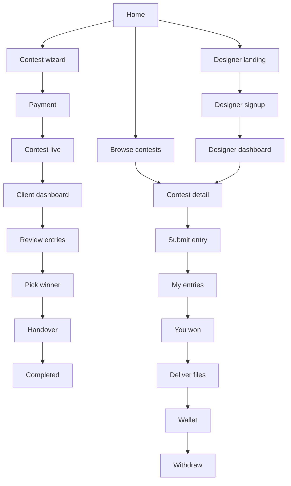
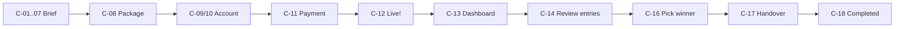
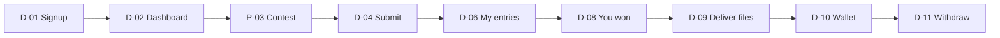

# logocontest.bd — UI Journey Blueprint

Companion to `BLUEPRINT.md`. That file defines rules and data; this file defines what every screen looks like, what is on it, and where each button goes. Every screen has an ID (for example `C-08`) so it can be referenced in prompts and bug reports.

Design for a 360px-wide phone first, then widen. All user-facing text goes through localization files (English default, Bangla toggle).

---

## 1. Design system

### 1.1 Feel

Clean, light, trustworthy, with lots of white space so the logos are the colourful thing on the page. Friendly but businesslike: the buyer is a shop or company owner paying real money.

Visual style (owner, 2026-10-07): **Golden Luxe** accents (red, maroon, cream, ink) on a cool light-grey SaaS layout like InsightHub — the home hero and the header sit inside one large rounded frame with a faint grid, the example panel overlaps the frame's bottom edge, the header is transparent until the page scrolls, centred headlines with a small eyebrow line above, large rounded panels with soft shadows, white cards with thin warm borders, icons in small rounded tiles, and a dark ink footer. Every page follows the same style.

### 1.2 Tokens

| Token | Value | Use |
|---|---|---|
| `primary` | `#8B0000` (Golden Luxe red) | Main buttons, links, active states, progress |
| `primary-dark` | `#5B0202` (maroon) | Button hover/pressed |
| `cream` | `#EDE7C7` (Golden Luxe cream) | Highlight bands, badges, selected backgrounds |
| `accent` | `#8A6D1F` (deep gold, derived from cream for readable text) | Prize amounts, stars, winner ribbon |
| `ink` | `#200E01` (near-black brown) | Headings, body text, dark buttons, footer |
| `muted` | `#6B7280` | Helper text, meta |
| `line` | `#E3E7EC` | Borders, dividers |
| `surface` | `#FFFFFF` | Cards |
| `canvas` | `#EEF1F5` (cool light grey) | Page background |
| `frame` | `#F6F8FA` | The large rounded hero frame |
| `success` | `#2E7D4F` | Paid, approved, live |
| `danger` | `#C0362C` | Reject, errors, bans |
| `warning` | `#B7791F` | Ending soon, pending |
| `info` | `#2B5C8A` | Handover chip |

- **Fonts:** Inter for English, Hind Siliguri for Bangla. Headings 600–700 weight, body 400.
- **Type scale (mobile → desktop):** H1 28 → 44px, H2 22 → 30px, H3 18 → 20px, body 16px, small 14px.
- **Radius:** 16px cards, 24px large panels, 10px inputs and buttons, full for pills.
- **Spacing:** 4px grid; page side padding 16px mobile, max content width 1200px.
- **Shadows:** one soft shadow for cards; none on flat lists.
- **Touch targets:** minimum 44px tall.

### 1.3 Shared components

| Component | Notes |
|---|---|
| Button | Primary (filled teal), Secondary (outline), Danger (red outline), Ghost (text). Loading state shows a spinner and disables the button |
| Input | Label above, helper text below, error text in red below. Never placeholder-only labels |
| Stepper | Thin progress bar + "Step 3 of 11" text |
| Contest card | (owner, 2026-10-08) White card with the brand tile on top (the brand's first letter for now, the leading or winning logo later) and a red **Featured** pill on it for Promoted contests; then the package pill, brand name, business type, prize in amber with the designs count, and the time-left line with a thin progress bar. Blind and Private show as small outline pills. When a row has fewer cards than columns, the cards are centred |
| Entry card | Square watermarked preview, entry number, designer name (hidden from other designers in Blind), stars, state chip |
| Status chip | Contest: Draft (grey), Awaiting payment (grey), Live (green), Judging (amber), Winner picked (blue), Handover (blue), Completed (teal), No result (grey), Cancelled (red). Entry: Rejected (red) |
| Price summary | Prize, service fee 20%, upgrades, total. Sticky bottom bar on mobile, right sidebar on desktop |
| Star rating | 5 tappable stars, large enough for thumbs |
| Modal / bottom sheet | Modal on desktop, bottom sheet on mobile |
| Toast | Top of screen, auto-dismiss after 4 seconds |
| Empty state | Simple illustration, one sentence, one action button |
| Countdown pill | "3 days left"; turns amber under 24 hours |

### 1.4 Global states every screen must handle

Loading (skeletons, not spinners, for lists and grids), empty, error with a retry button, and offline/slow connection for uploads (show progress per file and allow retry of a single failed file).

---

## 2. Navigation

### 2.1 Header

- **Guest:** Logo | Browse Contests | How It Works | Call: 01712028511 | Log In. Language toggle (EN / বাংলা) sits at the far right.
- **Client logged in:** Log In is replaced by an avatar menu: Dashboard, Create Contest, Payments, Profile, Log out.
- **Designer logged in:** avatar menu: Dashboard, My Entries, Wallet, My Profile, Log out. A bell icon with unread count sits next to the avatar for both roles.
- **Mobile:** logo left, bell and hamburger right. The phone number is a tap-to-call link inside the menu, and the language toggle sits at the bottom of the menu.

### 2.2 Mobile bottom bar (logged in only)

- **Client:** Contests | Create (centre, highlighted) | Alerts | Profile
- **Designer:** Browse | My Entries | Wallet | Profile

### 2.3 Overall map

---

## 3. Public screens

### P-01 Home

Sections top to bottom:

1. **Hero.** Centred. Eyebrow "Logo contests · Bangladesh". H1 "Many designers. Many ideas. One perfect logo." Sub-line "Get your logo from Bangladesh's best designers." An input "Your business name" with a **Get Started** button; submitting carries the name into `C-01`, so a client is on board in one step. Under it a trust row: "Pay with bKash or card", "Your payment is held until you approve the files", "Call us: 01712028511". Below: a large rounded panel showing an example contest (our own sample logos, clearly labelled "Example", no invented counts).
2. **Recent winning logos.** Grid, 3 rows (2 columns mobile, 4 desktop). Each tile: logo mockup, brand name, "৳5,000 · 34 designs". Button **Browse more** → `P-02`. If there are no completed contests yet, the heading becomes "Contests live right now" and shows contest cards.
3. **How it works** (owner, 2026-10-08, from a reference). On desktop, each step is a row: title and text on the left, a numbered dot on a wavy dashed line running down the middle, and a small mock of the product on the right: (1) the brief's look-and-feel sliders, (2) two example entries with stars and a client comment, (3) the picked winner with a ribbon. On phones the line runs down the left with the dots, and each mock sits under its text. The mocks use our own sample logos, labelled as examples. Button **Get Started**.
4. **Why Logo Contest.** Five benefits as a bento grid (owner, 2026-10-08): a tall dark card for "Many ideas, one price" showing a grid of our sample logos, then four smaller cards, each with a small picture of its point: pay in taka (bKash and card chips), original human-made logos (Human-made ✓ / AI-made ✕), the logo is yours (copyright with AI/SVG/PNG/PDF files), your money is safe (You pay → We hold → Designer paid). One column on phones, two on tablets, three on desktop. Then a comparison table: Freelancer | Design agency | logocontest.bd.
5. **Q&A.** Accordion, 8–10 questions. Every number in the answers comes from settings.
6. **Footer.**

The "For designers" band was removed from the home page (owner, 2026-10-07); designers reach `P-07` from "I'm a designer" on `P-11`.

Mobile: a sticky bottom button **Start a Contest** appears after the hero scrolls out of view.

### P-02 Browse contests

Layout (owner, 2026-10-07, from the LogoArena reference): a dark ink page header ("Start a logo contest. Get designs from Bangladesh's best designers." with **Start a Contest**), then a **Featured contests** row (Promoted contests that are open, up to 3 cards), then **All contests** as a list of wide rows on every screen size.

- Status tabs with counts: Open (default), Judging, Completed (completed and no-result). Sort: Ending soon (default for Open), Newest, Highest prize. Filter: business type. All of these live in the URL, so a filtered list can be shared.
- Each row (owner, 2026-10-08, second reference): a large square tile on the left (the brand's first letter for now; the leading or winning logo once entries exist), then the brand name with a filled package pill (Economy grey, Standard ink, Premium red, Custom gold) and outline pills for Featured, Blind and Private, a meta line "IT & software · Started 2 days ago", and two lines of the business description. On the right two small boxes, prize (amber, with the package name under it) and entries count, and under them the status line: time left with a thin progress bar while open, "Judging · pick by {date}" while judging, "Contest complete" when done. Designers also see a heart to save the contest.
- Private contests show brand name as "Private contest" with a lock icon and no brief preview for guests.
- 20 rows per page with numbered pages and "Showing 1–20 of 134 contests".
- Empty state: "No contests here yet." with **Start a Contest**.

### P-03 Contest detail

Header (owner, 2026-10-07, from the LogoArena reference): one white panel. Left: brand name, badges (Featured for Promoted, Blind, Private), business type and package, "by [client]", the business description. Right: a stats card with entries count, prize in large amber text and time left, then the contest timeline as three short progress bars with dates: **Accepting entries** → **Judging** (pick a winner) → **Files & handover**. The primary button sits under the stats.

Three tabs, **Entries** first when there are entries to show, otherwise **Brief**:

- **Brief:** description, logo text and slogan, chosen styles (as small labelled thumbnails), colours (swatches with hex), where the logo will be used, likes and dislikes, reference files.
- **Entries:** grid of entry cards.
- **Comments:** the public contest comments, newest last, each with the commenter's name ("Client" badge) or designer username. The client and signed-in designers see a box at the bottom (500 characters, counter); others see "Only the client and designers can comment." with **Log in** for guests. Authors can delete their own comment.

What the Entries tab shows depends on who is looking:

| Viewer | Open contest | Blind contest |
|---|---|---|
| Guest or other client | All active entries (watermarked) | Message: "This is a blind contest. Only the client can see the entries." After completion, the winning logo only if the client made it public |
| Designer | All active entries | Only their own (after completion, plus the winning logo if the client made it public) |
| Owner client | All, with review tools (`C-14`) | Same |

Primary button changes by viewer: guest → **Log in to submit**; designer → **Submit a Design** (no entry limit); owner → **Review entries**. After completion, the winning entry is pinned first with a ribbon.

### P-04 Entry detail (lightbox)

Full-screen image carousel (swipe on mobile) with slot labels: Icon, Full logo, Logo story, Facebook cover, Mockup. Below: logo story text, star rating if given, designer name linking to `P-06` (in blind contests, hidden from everyone except the client), and a small **Report** link → bottom sheet with reason, optional note and optional link. When a designer reports an entry as copied, the sheet also asks for an image of the similar logo (upload) and one or more links to where it appears. Under the submit button, in small text: "False flags get a warning. 3 warnings and your account is closed."

### P-05 Winners gallery

Masonry-style grid of winning logos with business-type filter chips. Tile tap opens the contest in `P-03`.

### P-06 Designer public profile

Top: photo, name, badges (Top Designer, Monthly Champion with month), bio, "12 wins · 87 designs · ৳45,000 earned" (total earned is public). A **Share profile** button opens a sheet with the QR code (downloadable) and a copy-link button. Tabs: **Winning logos** | **All designs** (each with its stars). No contact details and no message button anywhere.

### P-12 Client public profile

Top: photo, business name (or name), "Member since [month year]", stats "৳18,000 spent · 3 contests". Below: the client's non-private contests as contest cards (status chip, prize); completed ones show the winning logo (blind contests only if the client made it public). No contact details and no message button.

### P-07 Designer landing

Headline "Design logos. Win contests. Get paid in bKash." Three steps, the fee tier strip, the rules in five bullets (original work only, no AI logos, no contact with clients, deliver source files, copy = ban), then **Create designer account** → `D-01`.

### P-08 How It Works / P-09 FAQ / P-10 legal pages

Simple text pages. How It Works has two tabs: For clients, For designers. Legal pages: Terms, Privacy, Payment & No-Refund Policy, Designer Rules.

### P-11 Log in

One field "Mobile number or email" and password. Links: "Forgot password?" (asks for the email and sends a reset link; the link opens a "Set a new password" page), "I want a logo" → `C-01`, "I'm a designer" → `D-01`.

---

## 4. Client journey

### Wizard frame (applies to C-01 to C-11)

- Top: back arrow, stepper, "Save & exit" link.
- Middle: one question with a large heading and a one-line helper.
- Bottom: **Next** button, full width on mobile. Disabled until the step is valid.
- From C-08 onward the price summary is visible.
- Leaving mid-way shows: "Your answers are saved on this device."

| ID | Heading | Controls | Notes |
|---|---|---|---|
| C-01 | What's your business or brand name? | Text input; optional "Text to show on the logo" and "Slogan" behind a "+ Add" link | Pre-filled if it came from the hero |
| C-02 | What kind of business is it? | Dropdown of business types + short description textarea with character counter; under it **5 suggestions** written for the chosen business type and brand name — tap one to fill the box, then edit it | Example text shown as helper, not placeholder |
| C-03 | Do you have a website or Facebook page? | URL input + checkbox "I don't have one yet" | Skippable |
| C-04 | Which logo styles do you like? | Tappable image tiles (multi-select), each with two example shapes and a label; three style sliders below: Minimal ↔ Complex, Modern ↔ Classic, Playful ↔ Serious | At least one tile. Example shapes are our own drawings, never real brand logos |
| C-05 | Pick your colours | Up to 5 swatch slots that open a colour picker with hex field; toggle "Let designers choose"; then checkboxes "Where will you use the logo?" | |
| C-06 | Tell designers what you like and don't like | Two textareas, "I like" and "I don't like", each with **5 suggestions** built from the earlier answers (business type, styles, colours, where the logo is used); tap to fill, then edit | Contact filter runs here; inline error if tripped |
| C-07 | Any examples or a current logo? | Drag-and-drop zone / file picker, thumbnails with remove icons | Optional; note "For reference only. Designers will not copy these." |
| C-08 | Choose your prize | Four package cards (Standard marked Recommended); Custom reveals an amount input; duration selector (5 / 7 / 10 days); upgrade rows with toggle and price | Summary updates live |
| C-09 | Where should we send updates? | Mobile input and email input (both required, no OTP) | Number or email already used → "You already have an account. Log in" |
| C-10 | Create a password | Password with show/hide and strength hint | **Create account** asks for browser notification permission, then sends the welcome push and the 6-digit email code |
| C-11 | Review and pay | "Your name" input (required, saved to the account); collapsible brief recap with Edit links; full price breakdown; method tiles (bKash, Card); checkbox "I agree to the Terms and understand payments are non-refundable"; button **Pay ৳6,000** | Opens gateway checkout |

**C-08 package card content:** name, prize amount, one line ("Good for new pages and small shops" / "Most popular" / "Attracts experienced designers"), and "You pay ৳X including service fee".

**C-08 Blind upgrade wording:** "Blind contest (+৳1,000): designers can't see each other's work, so they can't copy ideas."

### C-11b Payment result

- **Success** → `C-12`.
- **Failed or cancelled:** "Payment didn't go through. Your contest is saved as a draft." Buttons **Try again** and **Go to dashboard**.

### Email confirmation banner (all pages, signed-in users with an unconfirmed email)

A thin bar above the header: "Please confirm your email. Enter the 6-digit code we sent to x@y.com." with a code box, **Confirm** and **Resend code**. A right code shows "Email confirmed" and the bar disappears. A wrong code says how many tries are left (5 tries, then a new code is needed); a new code can be asked for once a minute. The same form is on its own page, `/verify-email`, which the welcome push notification opens.

Browser push: pressing **Create account** (`C-10`) asks the browser for notification permission. If allowed, a "Welcome to logocontest.bd" notification arrives at once; if not, sign-up carries on without it.

### C-12 Contest live

Confetti once. "Congratulations! Your logo contest is live." Shows the contest link with a copy button, a **Share on Facebook** button, and a short "What happens next" list: designs start arriving, rate and comment to guide designers, pick your winner by [date]. Button **Go to dashboard**.

### C-13 Client dashboard

- **Profile panel (owner, 2026-10-08):** the client's initial in a circle, "Hi, {name}", business name and "Member since {month year}", the **Create Contest** button, and four stats: contests run (paid), total spent (sum of paid payments, as on the public profile), active now, completed.
- Tabs: Active | Drafts | Completed (completed, no result and cancelled). The first tab with contests opens by default.
- Each contest is a full-detail card (owner, 2026-10-08): on the left the **winning logo** with a "Winner" ribbon once a winner is picked (the brand's first letter until then); then brand name, status chip, package pill and upgrade pills, business type; a facts grid with prize, amount paid for this contest (contest + extensions), entries, designers, started date, end date (or "Ended {date}"), and winner ("@username" or "Not picked yet"); the countdown while open; and the next action as a button ("Review entries", "Pick your winner", "Approve files", "Finish payment") plus **View contest**. Open contests also show **Extend**; when there are fewer than 5 entries a hint reads "Only 3 designs so far. Extending gives designers more time."
- Empty state: "You haven't started a contest yet." with **Create Contest**.

### C-14 Review entries

Top summary bar: time left, entries, designers, an **Extend** button (open contests only), and filter chips: All | New | Shortlisted | Rejected.

**Extend sheet:** day options as tiles (+3 / +5 / +7 days), each showing the new end date and its price at ৳500 per day (৳1,500 / ৳2,500 / ৳3,500), the no-refund checkbox, and **Pay ৳{days × 500}**. Opens the gateway checkout; on success a toast "Your contest now ends on [date]" and the countdown updates; on failure nothing changes.

Grid of entry cards (2 columns mobile). Each card has quick actions under it: stars, heart (shortlist), and a "…" menu with Comment, Reject, Report.

A banner appears in the judging phase: "Your contest has ended. Pick your winner by [date]. If you don't, the prize is shared equally among all designers and you won't receive final files."

### C-15 Entry review (full view)

Image carousel on top. Below, in order: star rating row, **Shortlist** toggle, logo story, comment thread, then two buttons pinned at the bottom: **Reject** (danger outline) and **Pick as winner** (primary; only enabled in open or judging state). The "…" menu also has **Give a strike** → sheet with a required reason and the note "Strikes count immediately. 3 strikes and the designer is banned."

- **Comment thread:** chat-style bubbles. The input is disabled with "Waiting for the designer's reply" when it is not the client's turn. Filter errors appear inline.
- **Reject sheet:** radio list of reasons (Looks AI-generated, Looks copied, Doesn't match the brief, Low quality, Other + note). Confirm button **Reject design**. After confirming, a toast "Design removed from your contest" and the view moves to the next entry.
- Swipe left/right moves between entries on mobile.

### C-16 Pick winner

Confirmation modal with the entry preview: "Make #14 by Rafi your winner? This can't be undone. The designer will send your final files within 3 days." Buttons **Yes, pick this winner** and Cancel. Success screen: "Winner selected! We'll notify you when your files are ready."

### C-17 Handover

A four-step tracker: Winner picked → Files uploaded → Your review → Done.

- **Waiting state:** "The designer is preparing your files. Due by [date]."
- **Missed deadline state:** "The designer didn't deliver the files in time. Please pick another winner." Button **Pick another winner** → `C-14` (the forfeited entry is marked and cannot be picked), shown with "Pick by [date] (3 days)". A secondary link **Give the designer a strike** opens the strike sheet.
- **Files ready state:** list of files with type icons (AI, EPS, SVG, PDF, PNG, JPG) and download buttons, **Download all**, font names. Two buttons: **Approve files** and **Request a change** (opens a note field; shows "1 of 2 change requests left"). **Approve files** opens a sheet: 5 tappable stars (required) and "Feedback for the designer" (required, max 120 words, live word counter), then **Approve and release payment**. A note: "Please approve or ask for a change by [date]. If you don't respond, the contest ends with no result and you won't receive the files."

### C-18 Completed

"Your logo is ready." Download buttons stay available, plus a copyright transfer summary with a download link, and **Start another contest**. Blind contests also show a switch "Show the winning logo publicly" (off by default); when on, the logo appears with the designer's name.

### C-19 Payments

List of payments: date, contest, amount, method, status, and a receipt link. Total spent at the top.

### C-20 Profile

Photo, name, business name, mobile (verified tick), email, change password. A username field (shows the `P-12` link) and a stat card at the top: **Total spent ৳X** (also shown publicly on `P-12`). Link **View public profile**.

### C-21 Create Contest (returning client)

Same wizard, steps C-01 to C-08, then straight to C-11. An option at the start: "Start from a previous brief".

---

## 5. Designer journey

### D-01 Signup

Four short screens with a stepper:

1. Full name, mobile (no OTP)
2. Email, password
3. Username (live availability check, shows the profile link preview), bio with counter, optional photo
4. Payout method: tabs bKash | Bank. Then the Designer Rules in five bullets with a required checkbox. Button **Create account**.

### D-02 Designer dashboard

- Top card: wallet balance, current fee ("7% fee · 2 more wins to reach 5%") with a progress bar, wins count.
- **Needs your attention:** new client comments, revision requests, files due.
- **Open contests for you:** contest cards, with filter chips (Ending soon, Highest prize, Not entered).
- Strikes, if any, appear as a warning banner with the reason.
- **Saved contests:** contests the designer saved with the heart, as list rows, newest saved first, each with the heart to unsave. Until the full dashboard is built this lives at `/dashboard/saved`, linked from the account menu.

### D-03 Contest detail (designer view)

Same as `P-03`, plus a sticky bar: prize, time left, "Your entries: 2", and **Submit a Design**. A reminder line under the brief: "Original, human-made logos only. No AI logos. No contact details."

### D-04 Submit a design

One scrolling page with clear sections:

1. **Images.** Five labelled required tiles (Icon, Full logo, Logo story, Facebook cover, Other mockup) and a row "+ Add more (up to 5)". Each tile shows the recommended size, upload progress, a thumbnail when done, and replace/remove icons. A counter reads "6 of 10 images".
2. **Logo story.** Textarea with a 50–600 character counter.
3. **Confirm.** The seven declaration checkboxes, each on its own row. "Select all" is not offered.
4. **Submit design** button, disabled until everything is valid. A checklist above it shows what is still missing.

Errors are specific: "Icon image is too small (minimum 1000px)."

### D-05 Submitted

"Design submitted. You're #14 in this contest." Buttons **View my entry** and **Find more contests**.

### D-06 My entries

Tabs: Active | Rejected | Won | Past. Each row: preview, contest name, status chip, stars if rated, and an unread-comment dot. Rejected rows show the reason given by the client.

### D-07 Entry detail (designer view)

Carousel, rating, the comment thread (reply box enabled only when it is the designer's turn), and **Submit a new design** (opens `D-04` for the same contest) when the client has asked for changes in a comment. A **Withdraw entry** link sits at the bottom.

### D-08 You won

Full-screen celebration: "You won! ৳5,000 contest: [brand]". Shows the breakdown: prize, fee 7%, "You'll receive ৳4,650 after the client approves your files". Button **Deliver files now**. Deadline shown clearly, with: "If you don't upload your files by [date], your win is cancelled."

### D-09 Deliver files

Six required upload rows, one per file type (AI, EPS, SVG, PDF, PNG transparent, JPG), each with a tick when done. Font names field. A copyright transfer agreement in a scroll box with a checkbox. Button **Send files to client**.

After sending: the same four-step tracker as `C-17`, with "Waiting for the client until [date]. If they don't respond, the prize is shared equally among all designers." If a change is requested, the client's note appears at the top with the upload rows reopened.

### D-10 Wallet

- Balance card: **Available ৳4,650** and "Pending ৳0" with a tooltip explaining pending.
- Fee tier card with progress bar and the three tiers shown as steps.
- **Withdraw** button (disabled under ৳500 with the reason shown).
- Transaction list: date, description, amount in green or red, running balance. Each prize row expands to show prize, fee rate, fee amount.

### D-11 Withdraw

Amount input with a "Max" shortcut, payout method selector, summary, and **Request withdrawal**. Confirmation: "Request received. We'll send it to your [bKash/bank] soon." Status chips in history: Requested, Paid (with transaction ID), Rejected (with reason).

### D-12 My profile (edit)

Edit photo, name, bio; preview of the public profile; **Share profile** with QR; payout methods; change password.

---

## 6. Notifications

### N-01 Notification centre

Bell icon opens a panel (desktop) or full page (mobile). Each item: icon, one-line message, time, unread dot; tapping goes to the exact screen that needs action. "Mark all as read" at the top. Empty state: "You're all caught up."

Messages are written as actions, for example: "3 new designs in [brand]. Review them", "Rafi replied to your comment", "You won [brand]! Deliver your files by 12 Oct", "৳4,650 added to your wallet".

---

## 7. Admin screens

Desktop-first, plain and dense. Left sidebar: Dashboard, Contests, Entries, Reports, Users, Payments, Withdrawals, Monthly Winner, Homepage, Blocked Terms, Settings, Audit Log.

| ID | Screen | Content |
|---|---|---|
| A-01 | Dashboard | Number tiles (contests live, payments this month, revenue, pending withdrawals, open reports), wizard drop-off chart by step, latest activity |
| A-02 | Contests | Table with filters; row actions: View, Edit brief, Extend (free, admin only, needs a reason), Force-award, Cancel |
| A-03 | Entries | Tabs: Flagged duplicates, Recently submitted. Side-by-side compare for duplicates. Action: Remove |
| A-04 | Reports | Queue with reason, entry preview, evidence image and links side by side. Actions: Uphold (with strike or ban), Dismiss, Dismiss as false (warns the flagger) |
| A-05 | Users | Search by name or mobile; profile drawer with strikes (who gave each and why), false-flag warnings, contests or entries, wallet. Actions: Suspend, Ban, Add strike, Remove strike |
| A-06 | Payments | Table of gateway payments with status and transaction ID |
| A-07 | Withdrawals | Requested list with designer payout details and a copy button. Actions: Mark paid (enter transaction ID), Reject (enter reason) |
| A-08 | Monthly winner | Ranked table for the month, flags for suspicious wins, **Confirm winner** |
| A-09 | Homepage | Pick and order featured winning logos |
| A-10 | Blocked terms | List with add/remove and a test box that shows whether sample text would be blocked |
| A-11 | Settings | Grouped form: Fees and tiers, Packages, Upgrades, Timers, Limits, Monthly prize |
| A-12 | Audit log | Read-only table of admin actions |

Every destructive admin action asks for confirmation and a short reason.

---

## 8. Key microcopy

| Place | Text |
|---|---|
| Hero button | Get Started |
| Wizard next | Next |
| Pay button | Pay ৳{total} |
| No-refund checkbox | I agree to the Terms and understand payments are non-refundable |
| Contact filter error | Contact details are not allowed. Please remove phone numbers, emails or links. |
| Blind notice | This is a blind contest. Only the client can see the entries. |
| Flag rule | False flags get a warning. 3 warnings and your account is closed. |
| Strike note | Strikes count immediately. 3 strikes and the designer is banned. |
| Win cancelled (client) | The designer didn't deliver the files in time. Please pick another winner. |
| Win cancelled (designer) | You didn't upload your files in time, so this win was cancelled. |
| Approve sheet | Approve and release payment |
| Reject confirm | Reject design |
| Winner confirm | Yes, pick this winner |
| Response deadline note | Please approve or ask for a change by {date}. If you don't respond, the contest ends with no result and you won't receive the files. |
| No result (contest page) | No result. The client didn't pick a winner, so the prize was shared equally among {count} designers. |
| Withdraw minimum | You need at least ৳500 to withdraw. |
| Generic error | Something went wrong. Please try again. |

---

## 9. Responsive rules

- **Under 640px:** single column, bottom nav, sticky bottom action bar, bottom sheets instead of modals, entry grids in 2 columns.
- **640–1024px:** two columns where useful, entry grids in 3 columns.
- **Over 1024px:** sidebars appear (price summary in the wizard), entry grids in 4 columns. Browse keeps its filters in one bar above the list.

## 10. Build order for the UI

Build the shared components in section 1.3 first, then screens in this order so each milestone in `BLUEPRINT.md` has its UI: P-01 and layout → C-01 to C-12 → P-02, P-03, P-04 → D-01 to D-07 → C-13 to C-16 → C-17, C-18, D-08 to D-11 → N-01 → admin A-01 to A-12 → P-05, P-06, P-12, P-07 and the text pages.
