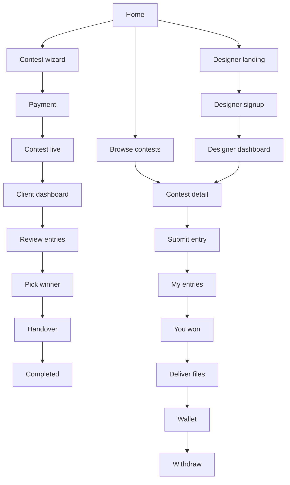
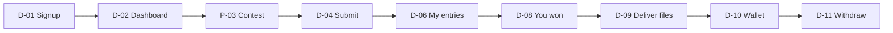

# logocontest.bd — UI Journey Blueprint

Companion to `BLUEPRINT.md`. That file defines rules and data; this file defines what every screen looks like, what is on it, and where each button goes. Every screen has an ID (for example `C-08`) so it can be referenced in prompts and bug reports.

Design for a 360px-wide phone first, then widen. All user-facing text goes through localization files (English default, Bangla toggle).

---

## 1. Design system

**Site-wide redesign (owner, 2026-10-10).** The approved home page design (`Design/logocontest-home-design.html`) is now the design system for the whole site and replaces the "Golden Luxe / pastel aurora" look below wherever they differ:

- **Look:** light grey page (`#ECEDF0`) with white rounded panels (28–32px corners) and soft shadows; brand red `#8B0000` with a red gradient for main buttons and icon badges; near-black ink `#111216`, grey text `#5F626B`, thin lines `#E7E8EC`; soft red tint `#FBECEB` for highlights. Section headings: an icon badge or a small pill, then the title with its last words in red.
- **Fonts:** Instrument Sans for headings, Urbanist for everything else, Hind Siliguri for Bangla.
- **Shared parts** (`src/components/ui`): buttons (red gradient, outline, dark, ghost), panel and card, badge and pill, section heading, form inputs, scroll reveal. Pages are restyled only with these.
- **Nav and footer everywhere:** every page uses the home page's floating white nav (one line with logo, Log in and a menu button that opens a drawer on phones) with the page starting below it, and the same footer with the large wordmark.
- **Admin panel:** rebuilt from the admin design handoff (`design/admin/`, `ADMIN-HANDOFF.md`, owner 2026-10-10), which replaces the earlier "same look as the public site" note: a white sidebar with icons, a white top bar (search, **View site ↗**, the bell for the Recent activity drawer, and the account menu), and shared admin parts (card, pill, KPI tile, tabs, `LC-0005` ID chip, checkbox). Admin colours are the `adm-*` tokens in `globals.css`. The top-bar search covers contests (name or `LC-` number), users and payments, each only with its permission. The account menu has no Profile item until an admin profile page exists (owner, 2026-10-10).
- **Admin sign-in and sign-out (owner, 2026-10-10):** admins sign in at `/admin-login`, a full page of its own (no public nav or footer): the brand and a drawing of admin cards on one side (no numbers, so nothing looks like real figures), the sign-in form on the other; phones show only the form. Any admin link while signed out (and the old `/login?next=/admin…`) goes there and returns to the page asked for. Signing out from the admin account menu opens `/admin-signed-out`: a red band, a "You are signed out" card with a cup of cha, **Sign in again** and **Go to the website**.
- **Admin bar on the public site (owner, 2026-10-10):** while an admin browses the site, a slim dark bar sits above the nav: "You are viewing the site as Super admin", **Back to admin panel**, and on a contest or profile page a shortcut to it in admin (hidden on phones to keep the bar to one line).
- **Motion:** scroll reveal on inner pages; no hero animations on dashboards, forms or the contest wizard. Reduced motion turns all of it off.
- Pages change only how they look: data, forms, checks, login, payments and links stay the same. Order: shared parts, then public browse and profiles, public info, auth, contest wizard, client area, designer area, admin; each group checked by the owner before the next.

### 1.1 Feel

Clean, light, trustworthy, with lots of white space so the logos are the colourful thing on the page. Friendly but businesslike: the buyer is a shop or company owner paying real money.

Visual style (owner, 2026-10-07; updated 2026-10-08 from the ofsp_ce reference): **Golden Luxe** accents (red buttons, ink text, gold prizes, cream highlights) on a soft **pastel aurora gradient** — sky blue, lilac-pink and peach-cream blobs washing over a near-white page, on every page. White, lightly glassy cards with very soft shadows and thin borders; feature cards are centred with a small duotone blob icon, a title, a line of text and an optional "Learn more" link; carousels have round arrow buttons and dot indicators; buttons are pills. No dark panels: page headers, dashboard panels and bands use the aurora gradient with ink text. The header is a **floating frosted-glass bar with softly rounded corners** (owner 2026-10-08: less round than a pill) (owner 2026-10-08: the dark pill did not match the site): white at 70% with a blur so the aurora shows through, a thin white ring, fully rounded, a small gap from the top and sides, soft shadow that deepens on scroll, and it **stays fixed at the top while scrolling**; ink wordmark and links in full-strength ink (not faded), the current page in a soft red-tinted pill, a red pill button on the right. Centred headlines with a small eyebrow line above, accent words in the italic display serif, and a footer on the page background (a thin line on top, link columns, then a bottom strip: © logocontest.bd · language switch English | বাংলা · social icons · Made in Bangladesh). Every page follows the same style. **Example logos** (owner, 2026-10-08): every product mock and example (hero contest, How it works, Why us, designers section, profile and wallet mocks) uses one set: our own "lc" logo pack, with the "lc" icon as the winner, plus the lettermark examples the owner chose (`public/examples/hero/`). The example contest is "LOGO CONTEST BD". The logo-style tiles in `C-04` are separate (see `C-04`).

### 1.2 Tokens

| Token | Value | Use |
|---|---|---|
| `primary` | `#8B0000` (Golden Luxe red) | Main buttons, links, active states, progress |
| `primary-dark` | `#5B0202` (maroon) | Button hover/pressed |
| `cream` | `#EDE7C7` (Golden Luxe cream) | Highlight bands, badges, selected backgrounds |
| `accent` | `#8A6D1F` (deep gold, derived from cream for readable text) | Prize amounts, stars, winner ribbon |
| `ink` | `#200E01` (near-black brown) | Headings, body text, dark buttons, footer |
| `muted` | `#6B7280` | Helper text, meta |
| `line` | `#E3E7EC` | Borders, dividers |
| `surface` | `#FFFFFF` | Cards |
| `canvas` | `#EEF1F5` (cool light grey) | Page background |
| `frame` | `#F6F8FA` | The large rounded hero frame |
| `success` | `#2E7D4F` | Paid, approved, live |
| `danger` | `#C0362C` | Reject, errors, bans |
| `warning` | `#B7791F` | Ending soon, pending |
| `info` | `#2B5C8A` | Handover chip |

- **Fonts:** Inter for English, Hind Siliguri for Bangla. Headings 600–700 weight, body 400.
- **Type scale (mobile → desktop):** H1 28 → 44px, H2 22 → 30px, H3 18 → 20px, body 16px, small 14px.
- **Radius:** 16px cards, 24px large panels, 10px inputs and buttons, full for pills.
- **Spacing:** 4px grid; page side padding 16px mobile, max content width 1200px.
- **Shadows:** one soft shadow for cards; none on flat lists.
- **Touch targets:** minimum 44px tall.

### 1.3 Shared components

| Component | Notes |
|---|---|
| Button | Primary (filled teal), Secondary (outline), Danger (red outline), Ghost (text). Loading state shows a spinner and disables the button |
| Input | Label above, helper text below, error text in red below. Never placeholder-only labels |
| Stepper | Thin progress bar + "Step 3 of 11" text |
| Contest card | (owner, 2026-10-08) White card with the brand tile on top (owner, 2026-10-08: once a design is submitted, the tile shows its cover mockup: the winning design with a small gold trophy in the corner once picked, otherwise the highest-rated design, otherwise the newest; the brand's first letter until then. Blind and private contests keep the letter or lock in public lists; the client's own dashboard shows their design) and a red **Featured** pill on it for Promoted contests; then the package pill, brand name, business type, prize in gold with the designs count as a small pill with a grid icon ("1 design", "2 designs"); next to the package pill, up to three overlapping photos of the designers who took part and "+N" (owner, 2026-10-08; never for blind or private contests), and the time-left line with a thin progress bar. Blind and Private show as small outline pills. When a row has fewer cards than columns, the cards are centred |
| Entry card | Square preview (no watermark, owner 2026-10-08), entry number, designer name (hidden from other designers in Blind), stars, state chip. Owner, 2026-10-08: a design with more than one mockup shows them as a grid in the square, like the reference: 2 images side by side, 3 as one large and two small, 4 or more as a 2×2 grid with "+N" on the last tile; a small "4 mockups" count and a comment count sit under it. The winning entry gets a small gold **trophy badge** in its corner (owner, 2026-10-08: our own drawing — gold cup with a shine, red ribbon, white star, dark base, tiny sparkles; floats gently) wherever a winner is shown: example panels, dashboards, contest pages |
| Status chip | Contest: Draft (grey), Awaiting payment (grey), Live (green), Judging (amber), Winner picked (blue), Handover (blue), Completed (teal), No result (grey), Cancelled (red). Entry: Rejected (red) |
| Price summary | Prize, service fee 20%, upgrades, total. Sticky bottom bar on mobile, right sidebar on desktop |
| Star rating | 5 tappable stars, large enough for thumbs |
| Modal / bottom sheet | Modal on desktop, bottom sheet on mobile |
| Toast | Top of screen, auto-dismiss after 4 seconds |
| Empty state | Simple illustration, one sentence, one action button |
| Countdown pill | "3 days left"; turns amber under 24 hours |

### 1.4 Global states every screen must handle

Loading (skeletons, not spinners, for lists and grids), empty, error with a retry button, and offline/slow connection for uploads (show progress per file and allow retry of a single failed file).

### 1.5 Motion (owner, 2026-10-08)

Smooth, calm motion on every page so the site feels premium. Short and soft (about 0.2–0.9 s, ease-out), never bouncy or in the way, and nothing moves for people who ask for reduced motion.

- **Page change:** each page fades and rises in; the header and footer stay put. Page titles come in softly from a light blur.
- **Menus:** on desktop a soft pill glides under the link you point at and settles back on the current page. The avatar menu and the phone menu open with a small pop from where they were tapped, their items sliding in one after another; the phone menu's three lines turn into an X.
- **Numbers:** stat numbers (dashboard, manage contest) count up from zero when the page opens.
- **Scrolling:** sections further down rise in as they scroll into view (browsers that can't do this just show them).
- **Buttons and cards:** buttons lift slightly on hover and press in when tapped; the main red button has a light sheen that sweeps across on hover. Cards lift on hover. Dialogs open with a gentle scale-in on desktop and slide up on phones.
- **Wizard:** each step's heading and fields slide in when the step changes.
- **Follows the mouse (owner, 2026-10-08: "everything moves when the mouse moves"):** on computers with a mouse, buttons and pill links lean a few pixels toward the pointer and spring back; cards and tiles tilt gently toward it with a soft gold light under the pointer; icons inside buttons grow a little on hover; text links draw their underline from left to right; tab and filter bars get a highlight that glides to the item under the pointer. Not on touch screens.
- **The prize always moves:** every prize amount has a gold shine that sweeps across it every few seconds, and the big prize tiles (manage contest, contest page) glow softly.
- **Bars:** progress and time-left bars fill in from zero and a light shimmer runs along them.
- **Section headings** rise in as they scroll into view.
- **Add-ons (owner, 2026-10-08):** each add-on's icon bobs gently all the time; an active add-on shows a pulsing live dot; on hover the row lifts, tilts toward the mouse, a light sheen sweeps across it, its icon turns and grows and the price turns red.

---

## 2. Navigation

### 2.1 Header

- **Look:** the floating frosted-glass bar from §1.1 on every page, fixed at the top while scrolling. The logo is the owner's logo pack (2026-10-08, `public/brand/`): the full "lc LOGO CONTEST.bd" lockup in maroon in the header and footer, white versions for dark backgrounds, and the white "lc" mark on a maroon square as the favicon, home-screen icon and push notification icon. On phones the pill holds the logo and the menu button; the menu opens as a white rounded card under the pill. The links sit centred in the space between the logo and the right-hand controls, so the gaps on both sides match (owner, 2026-10-08).
- **Notifications (owner, 2026-10-08):** a bell before the avatar with a red unread count; it opens a panel with the latest notifications (icon, text, time ago, unread dot), **Mark all as read** and **See all** (`/notifications`). On phones the bell sits next to the menu button.
- **Guest:** Logo | Browse Contests | Design Studio | How It Works | Help (owner, 2026-10-08: the phone number left the header; it is on the Help page) | **Join as a designer** (from 1280px wide; between 1024 and 1280px it is only in the menu, footer and How It Works so the links fit) (outline pill, owner 2026-10-08, opens `D-01`) | **Log In** (red pill). Language toggle (EN / বাংলা) sits at the far right. On phones, **Join as a designer** is a full-width button in the menu under Log In.
- **Client logged in:** Log In is replaced by an avatar menu: Dashboard, Create Contest, Payments, Profile, Log out.
- **Designer logged in:** avatar menu: Dashboard, My Entries, Wallet, My Profile, Log out. A bell icon with unread count sits next to the avatar for both roles.
- **Mobile:** logo left, bell and hamburger right. The menu lists the same links (Browse Contests, Design Studio, How It Works, Help); the language toggle sits at the bottom of the menu.

### 2.2 Mobile bottom bar (logged in only)

- **Client:** Contests | Create (centre, highlighted) | Alerts | Profile
- **Designer:** Browse | My Entries | Wallet | Profile

### 2.3 Overall map

---

## 3. Public screens

Home section headings (owner, 2026-10-08): every section title ends with an accent in the italic display serif and the red-to-gold gradient, typed out when the heading scrolls into view ("Contests live *right now*", "Your new logo in *three steps*", "More ideas, *less risk*", "Common *questions*").

### P-01 Home

**Approved design (owner, 2026-10-10):** the home for guests and admins follows `Design/logocontest-home-design.html`, on desktop and phone: its own floating nav (one line with logo, Log in and a menu button that opens a drawer under 720px) and its own footer with the large wordmark; hero, live contests, three steps, designers you can trust, why us with the comparison table, two ways in, Q&A. Instrument Sans headings, Urbanist body, Hind Siliguri for Bangla. Contests, prizes, design counts, days left and the Q&A come from the database; logo tiles show real winning logos (Homepage picks first, then the newest) and the design's placeholders where there are none. The mobile "Start a Contest" bar is gone; an admin's home picture (A-17) shows under the trust points. Other pages keep the site header and footer.

**One home per role (owner, 2026-10-08).** Logged out, everyone sees the home below. After logging in or signing up, `/` shows a different home for each role:

- **P-01c Client home:** for starting the next contest without the marketing page. A welcome line with the client's name, a big **Create a new contest** (with a "Your business name" box that carries the name into `C-01`) and **Go to my dashboard**; how a contest works in three steps; every package with its prize and what the client pays; contest length (3–30 days); every add-on with its price and what it does; what is always included (main logo, the six file types, full copyright) and the extras they can ask for; a short line with how many contests they have running. Ends with **Create a new contest** again.
- **P-01d Designer home:** a welcome line, **Browse open contests** and **My dashboard**; a few open contests; **Tips and tricks** for winning; **How to upload a logo** (step by step, with the real mockup limits from settings); **Rules and requirements** (original human-made work, no AI logos, no contact details, deliver the files within the deadline, copyright transfer, strikes and bans) and the fee tiers from settings.
- Admins keep the normal home.

Sections top to bottom:

1. **Hero.** Centred. Eyebrow "Logo contests · Bangladesh" as a small pill with a pulsing dot. H1 "Many designers. Many ideas." in the sans font in ink, then the accent line in an italic display serif (Instrument Serif; Tiro Bangla in Bangla) in a red-to-gold gradient that types itself out, pauses, erases and types the next phrase: "One perfect logo." → "One logo you'll love." → "One fair price in taka." (owner, 2026-10-08). Sub-line "Get your logo from Bangladesh's best designers." An input "Your business name" with a **Get Started** button; submitting carries the name into `C-01`, so a client is on board in one step. Under it the trust points in one floating glass bar (owner, 2026-10-08: a single bar that bobs gently, three parts split by thin lines, each with an icon tile, a bold line and a small line: bKash or card / Pay in taka; Money held safe / Until you approve the files; 01712028511 / Call us for help; stacked on phones). The parts rise in one after another. The side floating cards were removed (owner, 2026-10-08). Nothing moves for visitors who ask for reduced motion. Below: a large rounded panel showing an example contest, clearly labelled "Example", no invented counts (owner, 2026-10-08): brief "LOGO CONTEST BD", Services & consulting, the Premium prize from settings, Lettermark and Emblem, maroon/gold/ink. Entry #1, the winner, is our own "lc" icon, and the "Winner picked" box shows our full logo; entries #2–#5 are lettermark examples the owner chose (`public/examples/hero/`); the sixth tile says "More designs coming in" instead of a number.
2. **Recent winning logos.** Grid, 3 rows (2 columns mobile, 4 desktop). Each tile: logo mockup, brand name, "৳5,000 · 34 designs". Button **Browse more** → `P-02`. If there are no completed contests yet, the heading becomes "Contests live right now" and shows contest cards.
3. **How it works** (owner, 2026-10-08, from a reference). On desktop, each step is a row: title and text on the left, a numbered dot on a wavy dashed line running down the middle, and a small mock of the product on the right: (1) the brief's look-and-feel sliders, (2) two example entries with stars and a client comment, (3) the picked winner with a ribbon. On phones the line runs down the left with the dots, and each mock sits under its text. The mocks use the example logos (§1.1), labelled as examples. Button **Get Started**.
4. **Designers you can trust** (owner, 2026-10-08, from a 99designs reference). Left: three columns of three square logo tiles at staggered heights. Right: eyebrow "Our designers", title "Work with designers *you can trust*", the Designer Rules in one paragraph (original work only, no copying, no contact outside the site; copied logos can be reported and an admin can remove them, strike or ban), and **See live contests →** `P-02`. Real designers only: each column is one designer with their photo on top, three public winning logos and "by [name]" linking to `P-06`; five stars arc over the photo only when clients have rated their winning entries, filled to the real average. Until three designers each have three public wins, the tiles are the example logos (§1.1) and our logo pack on coloured backgrounds, labelled "Example", with no photos, names or stars.
5. **Why Logo Contest.** Five benefits as a bento grid (owner, 2026-10-08): a tall dark card for "Many ideas, one price" showing a grid of the example logos (§1.1), then four smaller cards, each with a small picture of its point: pay in taka (bKash and card chips), original human-made logos (Human-made ✓ / AI-made ✕), the logo is yours (copyright with AI/SVG/PNG/PDF files), your money is safe (You pay → We hold → Designer paid). One column on phones, two on tablets, three on desktop. Then a comparison table: Freelancer | Design agency | logocontest.bd.
6. **Two ways in** (owner, 2026-10-08, from a 99designs reference; the reference's "Free Logomaker" card is replaced because we have no logomaker). Two centred cards side by side (stacked on phones), each with a product mock on a pastel tile with a small squiggle and ring, a title, a paragraph and a link: **Run a logo contest** (two example entries with a client comment → `C-01`) and **Join as a designer** (example profile with QR code → `D-01`). Both tiles are the same height so the titles line up.
7. **Q&A.** Accordion, 8–10 questions. Every number in the answers comes from settings.
8. **Footer.** Same background as the page. Brand and phone; columns For clients (Start a contest, Browse contests, How it works), For designers (Join as a designer, How it works for designers, Log in) and Legal (Terms, Privacy, Payment & No-Refund Policy, Designer Rules); bottom strip with © year, the language switch and "Made in Bangladesh". Social icons (Facebook page, Facebook group, Instagram, YouTube, LinkedIn) sit at the right of the bottom strip; each shows only when its link is set in admin settings (owner, 2026-10-08).

The "For designers" band was removed from the home page (owner, 2026-10-07); designers reach `P-07` from "I'm a designer" on `P-11`.

Mobile: a sticky bottom button **Start a Contest** appears after the hero scrolls out of view.

### P-02 Browse contests

Layout (owner, 2026-10-07, from the LogoArena reference): a page header (owner, 2026-10-08, from a reference: aurora panel; left the title "Start a logo contest. Get designs from Bangladesh's best designers.", "Here's how it works:" and five numbered steps — brief, designers send ideas, rate and comment, pick and get every file with full copyright, pay in taka with money held safe — then **Start a Contest** and **How it works**; right a staggered, slightly tilted collage of nine example logos the owner chose (`public/examples/browse/`), labelled Example, each column floating gently at its own pace; compact, side by side from tablet width, logos below the text on phones; no ratings or designer counts until real ones exist), then a **Featured contests** row (Promoted contests that are open, up to 3 cards), then **All contests** as a list of wide rows on every screen size.

- Status tabs with counts: Open (default), Judging, Completed (completed and no-result). Sort: Ending soon (default for Open), Newest, Highest prize. Filter: business type. All of these live in the URL, so a filtered list can be shared.
- Each row (owner, 2026-10-08, second reference): a large square tile on the left (the brand's first letter for now; the leading or winning logo once entries exist), then the brand name with a filled package pill (Economy grey, Standard ink, Premium red, Custom gold) and outline pills for Featured, Blind and Private, a meta line "IT & software · Started 2 days ago", and two lines of the business description. On the right two small boxes, prize (amber, with the package name under it) and entries count, and under them the status line: time left with a thin progress bar while open, "Judging · pick by {date}" while judging, "Contest complete" when done. Designers also see a heart to save the contest.
- Private contests show brand name as "Private contest" with a lock icon and no brief preview for guests.
- 20 rows per page with numbered pages and "Showing 1–20 of 134 contests".
- Empty state: "No contests here yet." with **Start a Contest**.

### P-03 Contest detail

Header (owner, 2026-10-07, from the LogoArena reference): one white panel. Left: brand name, badges (Featured for Promoted, Blind, Private), business type and package, "by [client]", the business description. Owner, 2026-10-08: the brand tile is larger with a white ring and shadow; business type and package are pills next to "by [client]" with the client's initial; the description has a thin accent line on its left. Under it (owner, 2026-10-08: the designs are not repeated here, they are in the tabs below), a full-width soft gold **How the prize works** card with three points side by side (held safely and paid once the client approves the files; the winner sends AI, EPS, SVG, PDF, PNG and JPG within the file-upload days setting; full copyright moves to the client). Then a white card with what the client wants: the text in the logo (display serif) and slogan, the logo styles, **where the logo will be used** (icon pills: Facebook / Instagram, website, signboard, packaging, print, merchandise, TV / video) with the colours as swatches and hex codes beside it on the same row. The contest timeline is centred: each step's dot sits in the middle of its column with its label and date centred under it, and the line runs from dot centre to dot centre. The stats card ends (under Save contest) with **Designers taking part** (real designers' photos, or their initial when they have no photo, overlapping, "+N", "3 designers"; only a lock in a blind contest for everyone but the client) and **Share this contest** (Facebook, WhatsApp, copy link). Blind contests hide the gallery from people who can't see the designs. On phones the prize sits on its own row at the top of the stats card. Right: a stats card with entries count, prize in large amber text and time left, then the contest timeline as three short progress bars with dates: **Accepting entries** → **Judging** (pick a winner) → **Files & handover**. The primary button sits under the stats.

Three tabs, **Entries** first when there are entries to show, otherwise **Brief**:

- **Brief:** description, short name / app name, logo text and slogan, target audience, chosen styles (as small labelled thumbnails), colours (swatches with hex), where the logo will be used, **What the client needs** (always-included items plus the ticked extras), **Requirements** next to it (owner, 2026-10-08: likes and dislikes are no longer shown, older contests included) (always-on rules plus the ticked ones and other requirements), reference files (owner, 2026-10-08).
- **Entries:** grid of entry cards (2 columns on phones, 3 on tablets, 4 on desktop). Clicking a card opens `P-04`.
- **Comments:** the public contest comments, newest last, each with the commenter's name ("Client" badge) or designer username. The client and signed-in designers see a box at the bottom (500 characters, counter); others see "Only the client and designers can comment." with **Log in** for guests. Authors can delete their own comment.

What the Entries tab shows depends on who is looking:

| Viewer | Open contest | Blind contest |
|---|---|---|
| Guest or other client | All active entries | Message: "This is a blind contest. Only the client can see the entries." After completion, the winning logo only if the client made it public |
| Designer | All active entries | Only their own (after completion, plus the winning logo if the client made it public) |
| Owner client | All, with review tools (`C-14`) | Same |

Primary button changes by viewer: guest → **Log in to submit**; designer → **Submit a Design** (no entry limit); owner → **Review entries**. After completion, the winning entry is pinned first with a ribbon.

### P-04 Entry detail (lightbox)

Opens when an entry card is clicked (`?tab=entries&entry=14`, so it can be shared). A large viewer with every mockup of the design (arrows, swipe on mobile, keyboard arrows, a row of thumbnails, "2 / 4"). Owner, 2026-10-08: beside the images (below on phones) the **comment box** for that design: every comment with the author's name ("Client" badge or designer username), newest last, and a box for the client and designers who submitted to the contest (500 characters; no mobile numbers, emails or social names — "Contact details are not allowed."). Below: star rating if given, designer name linking to `P-06` (in blind contests, hidden from everyone except the client), and a small **Report** link (flag icon) → bottom sheet. Owner, 2026-10-08, reasons as a radio list, each with a short line: **Copied from another logo**, **Made with AI**, **Uses a famous brand or trademark**, **Shows contact details**, **Nude, sexual or offensive**, **Something else**; then an optional note (500 characters) and optional links. Anyone signed in who can see the design may report it, except its own designer; guests see "Log in to report". One open report per person per design ("You've already reported this design."). When a designer reports an entry as copied, the sheet also asks for an image of the similar logo (upload) and one or more links to where it appears. Under the submit button, in small text: "False flags get a warning. 3 warnings and your account is closed."

### P-05 Winners gallery

Masonry-style grid of winning logos with business-type filter chips. Tile tap opens the contest in `P-03`.

### P-13 Design Studio (owner, 2026-10-08)

`/design-studio`, public and indexable. Every design uploaded to any contest collects here automatically, newest first, so visitors see how many logos are made on the site and that new ones come in every day.

- Top: a compact aurora banner with the title, one line ("Every design made on logocontest.bd, as it comes in"), a pulsing "Live" dot and real counts that count up: designs made, new today (Bangladesh time) and winning designs. No invented numbers.
- Filter: **All designs** | **Winners**.
- Grid of single tiles: one design = one tile showing its first mockup even when it has up to 8. Winning designs wear the trophy. Hovering shows the brand name, "#number" and the designer (hidden for blind contests). Tapping opens that design in its contest (`P-03` with the design open, where all its mockups are).
- **Load more** at the bottom (24 at a time).
- Only designs anyone may already see: contests that are public (not drafts, unpaid or cancelled) and not private; active, winning and forfeited designs (never rejected, withdrawn or removed); in blind contests only the winner, once the contest is completed and the client made the winner public.

### P-14 Help & contact (owner, 2026-10-08)

`/help`. Title "How can we help?" and one line. Four contact cards:

- **Live chat:** **Start live chat** loads the Tawk.to chat and opens it (see BLUEPRINT live chat). Until the IDs are set, the card says live chat is being set up, points to WhatsApp and shows a quiet "Coming soon" label instead of a button.
- **WhatsApp:** opens a chat with the support number (setting `contact.whatsapp`, default 01712028511) with a short greeting filled in.
- **Facebook Messenger:** opens Messenger with the Facebook page from the footer setting (`social.facebook`); hidden when that is empty.
- **Call us:** the support number as a tap-to-call link.

Below: quick links to How It Works, Payment & No-Refund Policy, Designer Rules and Terms.

### P-06 Designer public profile

Top: photo, name, badges (Top Designer, Monthly Champion with month), bio, "12 wins · 87 designs · ৳45,000 earned" (total earned is public). Owner, 2026-10-08, it is the designer's portfolio: beside the bio, **Experience** ("5 years"), **Skills** and **Tools** as chips. Buttons **Share profile** (a sheet with the QR code, downloadable, and a copy-link button) and **Download PDF** (the portfolio as a PDF file). Tabs: **Winning logos** | **All designs** (each with its stars), with counts; the profile opens on All designs until the designer has a win (owner, 2026-10-08). Each design shows its cover mockup, contest name, number and mockup count, and opens it on the contest page (`P-04`). Designs from private contests never show; from blind contests only the winner once the client made it public. The Designs count counts only these public designs; the designer's own dashboard (`D-02`) counts every design and lists every contest they entered with their newest design's cover. No contact details and no message button anywhere.

### P-12 Client public profile

Top: photo, business name (or name), "Member since [month year]", stats "৳18,000 spent · 3 contests". Below: the client's non-private contests as contest cards (status chip, prize); completed ones show the winning logo (blind contests only if the client made it public). No contact details and no message button.

### P-07 Designer landing

Headline "Design logos. Win contests. Get paid in bKash." Three steps, the fee tier strip, the rules in five bullets (original work only, no AI logos, no contact with clients, deliver source files, copy = ban), then **Create designer account** → `D-01`.

### P-08 How It Works / P-09 FAQ / P-10 legal pages

**How It Works** (owner, 2026-10-08, layout from a 99designs reference) at `/how-it-works`, with two tabs **For clients** | **For designers** (`?for=designers`):

- Top: H1 "How *it works*" (accent in the display serif), a short intro, and on the right the example contest panel. Under it a row of step links (1. Brief · 2. Designs · 3. Winner, or 1. Join · 2. Submit · 3. Get paid) and **Get Started** (clients) or **Join as a designer** (designers).
- Three step sections, alternating sides: a huge faint step number behind, a product mock on one side (the example logos from §1.1, labelled Example), and on the other the title (accent typed in on scroll), a short paragraph, three ticked points and three questions as an accordion. Every number in the answers comes from settings.
- "So, why *us*?": four true points with icons (no ratings, reviews or press logos until real ones exist).
- A band for the other side (clients see "Are you a designer?" → `D-01`; designers see "Need a logo?" → `C-01`), then "Questions?" with the phone number and a link to the home page Q&A.

FAQ and legal pages stay simple text pages. Legal pages: Terms, Privacy, Payment & No-Refund Policy, Designer Rules.

**P-10 legal pages (owner, 2026-10-09):** `/legal/[page]`. A narrow reading column: title, "Last updated [date]", a short summary box ("In short") and numbered sections with headings; on wide screens a sticky contents list on the left, on phones a contents list under the summary. A row of links to the other three legal pages at the bottom. Same text in English and Bangla (the language switch).

### P-11 Log in

After logging in (owner, 2026-10-08): clients go to their dashboard (`C-13`), designers to **Browse contests** (`P-02`), admins to the admin panel — unless the login was started from a specific page (`?next=`), which wins. A logged-in person who opens `/login` is sent to the same place.

Two steps (owner, 2026-10-08). Clicking **Log In** anywhere first asks "Who are you logging in as?" with two large cards: **I'm a client** ("I want a logo for my business") and **I'm a designer** ("I design logos and enter contests"). The choice opens the form at `/login?as=client` or `/login?as=designer` (any `?next=` is kept). Links that already know the role skip the first step: the wizard's "already have an account" (client), the designer sign-up page and the footer's For designers column (designer).

The form: title "Log in as a client" / "Log in as a designer", one field "Mobile number or email" and password, "Forgot password?" (asks for the email and sends a reset link; the link opens a "Set a new password" page). Under the card: "New here? **Start a contest**" (→ `C-01`) or "New here? **Sign up as a designer**" (→ `D-01`), and a link to switch to the other role. The choice only changes the words and links; the account's own role decides what the person sees after logging in.

### Wizard frame (applies to C-01 to C-11)

- Top: back arrow, stepper, "Save & exit" link.
- Middle: one question with a large heading and a one-line helper.
- Bottom: **Next** button, full width on mobile. Disabled until the step is valid.
- From C-08 onward the price summary is visible.
- Leaving mid-way shows: "Your answers are saved on this device."

| ID | Heading | Controls | Notes |
|---|---|---|---|
| C-01 | What's your logo name? | "Logo name (business or brand name)" input; under it "Short name / app name" (optional, owner 2026-10-08, e.g. for a short logo or app icon); optional "Text to show on the logo" and "Slogan" behind a "+ Add" link | Pre-filled if it came from the hero |
| C-02 | What kind of business is it? | Dropdown of business types + short description textarea with character counter; under it **5 suggestions** written for the chosen business type and brand name — tap one to fill the box, then edit it. Then **Target audience** (owner, 2026-10-08): "Who are your customers?" textarea, required, 10–300 characters, with **5 suggestions** built from the business type and what the client wrote in the description (city or area, online or shop, who buys). **How suggestions behave (owner, 2026-10-08, everywhere they are used):** each suggestion is a full, detailed sentence or two; tapping one fills the box and hides the list; when the box is empty again, a "Need ideas? See 5 suggestions" button brings the list back | Example text shown as helper, not placeholder |
| C-03 | Do you have a website or Facebook page? | URL input + checkbox "I don't have one yet" | Skippable |
| C-04 | Which logo styles do you like? | Tappable image tiles (multi-select), each with two example shapes and a label; three style sliders below: Minimal ↔ Complex, Modern ↔ Classic, Playful ↔ Serious | At least one tile. Examples (owner 2026-10-08, as in the 99designs reference): Wordmark = Facebook, Yahoo; Pictorial = Apple, NBC; Lettermark = F1, McDonald's; Calligraphic = Ray-Ban, Coca-Cola; Mascot = KFC, Tux. SVGs from Wikimedia Commons in `public/style-examples/`. Abstract and Emblem keep our own drawings (no free files). A small line under the tiles says the logos belong to their owners and credits Tux (Larry Ewing, The GIMP) |
| C-05 | Pick your colours | Up to 5 swatch slots that open a colour picker with hex field; toggle "Let designers choose"; then checkboxes "Where will you use the logo?"; then **What you need** (owner, 2026-10-08): a short "Always included" list with ticks (main logo; AI, EPS, SVG, PDF, transparent PNG and JPG files) and tappable cards for the extras: Icon only (app icon and favicon), Short logo (icon + short name), Colour, white and black versions, App icon sizes (1024×1024 master, iOS and Android) | |
| C-06 | Any requirements for designers? | (Owner, 2026-10-08: the "I like" and "I don't like" textareas and their suggestions were removed.) **Requirements**: "Always on" ticks (100% original work, full copyright transferred to you; no AI-generated logos) and checkboxes for: No stock or AI-made images in the final design; Show the app icon on a phone home screen mockup; plus "Other requirements" (optional, 500 characters) | Contact filter runs here; inline error if tripped |
| C-07 | Any examples or a current logo? | Drag-and-drop zone / file picker, thumbnails with remove icons | Optional; note "For reference only. Designers will not copy these." |
| C-08 | Choose your prize | Owner, 2026-10-08: six package cards (Starter, Growth marked Recommended, Pro, Premium, Elite, Custom), amounts in a clear dark colour; Custom reveals an amount input; contest length: quick-pick chips (3, 5, 7, 10, 14, 21, 30 days) plus a 3–30 day slider showing the end date; add-on cards (Featured, Blind, Private, Logo Scan, Highlight, Urgent, NDA) each with an icon, price and toggle — choosing NDA ticks Private as included. Everything moves gently: cards rise in, the chosen card lifts, the highlight glides between chips, the total counts to its new value | Summary updates live |
| C-09 | Where should we send updates? | Mobile input and email input (both required, no OTP) | Number or email already used → "You already have an account. Log in" |
| C-10 | Create a password | Password with show/hide and strength hint | **Create account** asks for browser notification permission, then sends the welcome push and the 6-digit email code |
| C-11 | Review and pay | "Your name" input (required, saved to the account); collapsible brief recap with Edit links; full price breakdown; method tiles (bKash, Card); checkbox "I agree to the Terms and understand payments are non-refundable"; button **Pay ৳6,000** | Opens gateway checkout |

**C-08 package card content:** name, prize amount, one line ("Good for new pages and small shops" / "Most popular" / "Attracts experienced designers"), and "You pay ৳X including service fee".

**C-08 Blind upgrade wording:** "Blind contest (+৳1,000): designers can't see each other's work, so they can't copy ideas."

### C-11b Payment result

- **Success** → `C-12`.
- **Failed or cancelled:** "Payment didn't go through. Your contest is saved as a draft." Buttons **Try again** and **Go to dashboard**.

### Email confirmation banner (all pages, signed-in users with an unconfirmed email)

A thin bar above the header: "Please confirm your email. Enter the 6-digit code we sent to x@y.com." with a code box, **Confirm** and **Resend code**. A right code shows "Email confirmed" and the bar disappears. A wrong code says how many tries are left (5 tries, then a new code is needed); a new code can be asked for once a minute. The same form is on its own page, `/verify-email`, which the welcome push notification opens.

Browser push: pressing **Create account** (`C-10`) asks the browser for notification permission. If allowed, a "Welcome to logocontest.bd" notification arrives at once; if not, sign-up carries on without it.

### C-12 Contest live

Confetti once. "Congratulations! Your logo contest is live." Shows the contest link with a copy button, a **Share on Facebook** button, and a short "What happens next" list: designs start arriving, rate and comment to guide designers, pick your winner by [date]. Button **Go to dashboard**.

### C-13 Client dashboard

Owner, 2026-10-08: it should feel premium and personal ("this site is yours"). Things rise in gently as the page loads and nothing moves for people who ask for reduced motion.

- **Welcome panel:** a large aurora panel with the client's initial in a gold-ringed circle, "Welcome back, {name}" (accent in the display serif), business name and "Member since", **Create Contest** (primary) and four stat tiles with icons: contests run, total spent (gold), live now, completed. A soft gold ribbon line under it: "Everything here is yours: your contests, your designs, your files."
- **Needs your attention:** a short row of cards only when there is something to do: designs waiting for a rating, contests ending within 24 hours (with **Extend**), contests in judging (with **Pick winner**).
- Tabs: Active | Drafts | Completed. The first tab with contests opens by default.
- **Contest card:** the leading or winning design on the left (trophy on the winner); status, package and add-on pills; brand name and business type; four facts in a row (prize in gold, paid, designs, designers); a time-left bar; and one clear button per state: **Manage contest** (live and judging), **Finish & pay** (drafts), **View files** (winner picked, later). A small "Public page ↗" link opens the public contest page. While the contest is live, an **Add-ons** link opens a pop-up with that contest's add-ons (Promote, Extend, Logo Scan, Private, Blind) — what is active and the price of the rest; buying one goes straight to checkout from the pop-up, without leaving the dashboard (owner, 2026-10-08). No second button that goes to the same place.
- Empty state: "You haven't started a contest yet." with **Create Contest**.

### C-13b Manage contest

Owner, 2026-10-08, at `/dashboard/contests/[slug]`, only for the contest's client:

- **Layout (owner, 2026-10-08):** below the header, **Review designs** on the left and an **Add-ons** sidebar on the right (sticky on desktop, one row per add-on); on phones the add-ons come after the designs.
- **Header:** brand tile, name, status, package, a live countdown, prize (gold) and quick stats (designs, designers, shortlisted, rated), **Public page ↗**.
- **Edit details (owner, 2026-10-08):** the header tile **Edit details** opens the brief editor; the manage page itself does not repeat the brief (owner, 2026-10-08 — the "Contest details" section was removed; the brief is on the public page). Editing (`/dashboard/contests/[slug]/edit`, while the contest is open) uses the same fields as the wizard except package, prize and length; saving notifies every designer who submitted ("The client updated the brief").
- **Add-ons:** titled "Add-ons for {contest name}", so a client with several contests always buys for the right one; each contest has its own manage page and the dashboard card links to it. Cards for **Featured** (Promoted), **Extend** (+3 / +5 / +7 days with the new end date and price), **Private**, **Blind** and **Logo Scan** (৳500), each with a one-line benefit and either "Active" or its price and **Add**. Only while the contest is open. Paying goes through the gateway and returns here with "Add-on active."
- **Review designs:** filter chips All | Shortlisted | Not rated | Rejected; a grid of design cards with the mockup grid, tappable stars (1–5), a heart (shortlist) and a "…" menu with **Reject** and **Pick as winner**. Clicking a card opens the design (`C-15`).

### C-14 Review entries

Top summary bar: time left, entries, designers, an **Extend** button (open contests only), and filter chips: All | New | Shortlisted | Rejected.

**Extend sheet:** day options as tiles (+3 / +5 / +7 days), each showing the new end date and its price at ৳500 per day (৳1,500 / ৳2,500 / ৳3,500), the no-refund checkbox, and **Pay ৳{days × 500}**. Opens the gateway checkout; on success a toast "Your contest now ends on [date]" and the countdown updates; on failure nothing changes.

Grid of entry cards (2 columns mobile). Each card has quick actions under it: stars, heart (shortlist), and a "…" menu with Comment, Reject, Report.

A banner appears in the judging phase: "Your contest has ended. Pick your winner by [date]. If you don't, the prize is shared equally among all designers and you won't receive final files."

### C-15 Entry review (full view)

Image carousel on top (owner, 2026-10-08: the same large viewer as `P-04`, with the owner tools in the side panel). Below, in order: star rating row, **Shortlist** toggle, **Check with AI** (owner, 2026-10-10: the AI copyright checker replaced Logo Scan; on the design cards and in a side box on the manage page, see BLUEPRINT §7.7), comment thread, then two buttons pinned at the bottom: **Reject** (danger outline) and **Pick as winner** (primary; only enabled in open or judging state). The "…" menu also has **Give a strike** → sheet with a required reason and the note "Strikes count immediately. 3 strikes and the designer is banned."

- **Comment box:** the design's comments (§10 of BLUEPRINT: the client and designers in the contest can post, no turns). Filter errors appear inline.
- **Reject sheet:** radio list of reasons (Looks AI-generated, Looks copied, Doesn't match the brief, Low quality, Other + note). Confirm button **Reject design**. After confirming, a toast "Design removed from your contest" and the view moves to the next entry.
- Swipe left/right moves between entries on mobile.

### C-16 Pick winner

Confirmation modal with the entry preview: "Make #14 by Rafi your winner? This can't be undone. The designer will send your final files within 3 days." Buttons **Yes, pick this winner** and Cancel. Success screen: "Winner selected! We'll notify you when your files are ready."

### C-17 Handover

A four-step tracker: Winner picked → Files uploaded → Your review → Done.

- **Waiting state:** "The designer is preparing your files. Due by [date]."
- **Missed deadline state:** "The designer didn't deliver the files in time. Please pick another winner." Button **Pick another winner** → `C-14` (the forfeited entry is marked and cannot be picked), shown with "Pick by [date] (3 days)". A secondary link **Give the designer a strike** opens the strike sheet.
- **Files ready state:** list of files with type icons (AI, EPS, SVG, PDF, PNG, JPG) and download buttons, **Download all**, font names. Two buttons: **Approve files** and **Request a change** (opens a note field; shows "1 of 2 change requests left"). **Approve files** opens a sheet: 5 tappable stars (required) and "Feedback for the designer" (required, max 120 words, live word counter), then **Approve and release payment**. A note: "Please approve or ask for a change by [date]. If you don't respond, the contest ends with no result and you won't receive the files."

Owner, 2026-10-09: for `timers.copy_claim_days` days after the pick, the handover section shows a quiet link **Report copied design** ("Is the winning design copied? Tell us by [date]"). It opens a sheet: what's wrong (required, 20–1000 characters), up to 5 links, and **Send claim**. While a claim is open the section shows "Claim under review"; afterwards the result (rejected with the admin's note, or upheld with what happens next).

### C-18 Completed

"Your logo is ready." Download buttons stay available, plus a copyright transfer summary with a download link, and **Start another contest**. Blind contests also show a switch "Show the winning logo publicly" (off by default); when on, the logo appears with the designer's name.

### C-19 Payments

List of payments: date, contest, amount, method, status, and a receipt link. Total spent at the top.

### C-20 Profile

Photo, name, business name, mobile (verified tick), email, change password. A username field (shows the `P-12` link) and a stat card at the top: **Total spent ৳X** (also shown publicly on `P-12`). Link **View public profile**.

### C-21 Create Contest (returning client)

Same wizard, steps C-01 to C-08, then straight to C-11. An option at the start: "Start from a previous brief".

---

## 5. Designer journey

### D-01 Signup

Four short screens with a stepper:

1. Full name, mobile (no OTP)
2. Email, password
3. Username (live availability check, shows the profile link preview), bio with counter (300 characters, no-contact filter), optional photo (for now added later from My profile, since photo uploads come with `D-12`)
4. Payout method: tabs bKash (number) | Bank (bank name, account name, account number; branch and routing number optional). Then the Designer Rules in five bullets (original work only; no AI logos; no contact with clients; deliver the source files on time; copying means a permanent ban) with a required checkbox. Button **Create account**: like client sign-up it asks for browser notification permission, sends the welcome push and the 6-digit email code, signs the designer in and opens **Browse Contests**.

Usernames: 3–20 characters, lowercase letters, digits and underscores, starting with a letter; unique ignoring case; words like admin, support, logocontest are reserved. The URL `/designers/signup` is linked from the header and from "I'm a designer" on `P-11`.

### D-02 Designer dashboard

- **Profile panel (owner, 2026-10-08):** photo (or initial), name, @username, member since, **Edit profile** and **Browse contests** buttons, and four stats: contests entered, designs submitted, wins, total earned.
- **Share your profile (owner, 2026-10-08):** the public profile link (`/d/{username}`) with **Copy link**, Facebook and WhatsApp share buttons (and the phone's own share sheet where available), and the QR code with **Download QR** (PNG), so the designer can put their profile on other sites and cards.
- **My contests:** every contest the designer submitted to, with their entries count there and the contest status; **Wins** lists the contests they won with the winning logo. Both show an empty state with **Browse contests** until there are entries.
- Top card: wallet balance, current fee ("7% fee · 2 more wins to reach 5%") with a progress bar, wins count.
- **Needs your attention:** new client comments, revision requests, files due.
- **Open contests for you:** contest cards, with filter chips (Ending soon, Highest prize, Not entered).
- Strikes, if any, appear as a warning banner with the reason.
- **Saved contests:** contests the designer saved with the heart, as list rows, newest saved first, each with the heart to unsave. Until the full dashboard is built this lives at `/dashboard/saved`, linked from the account menu.

### D-03 Contest detail (designer view)

Same as `P-03`, plus a sticky bar: prize, time left, "Your entries: 2", and **Submit a Design**. A reminder line under the brief: "Original, human-made logos only. No AI logos. No contact details."

### D-04 Submit a design

Owner, 2026-10-08. At `/contest/[slug]/submit`, for designers while the contest is open. One scrolling page:

1. **Mockups.** An upload box: "Add 1 to 8 mockups · JPG, PNG or WebP, up to 5 MB each" and "Any size works: each image is saved at 1000×1000 px for you, with nothing cut off." Picking several files at once is fine. Every image is fitted into 1000×1000 automatically (whole image centred, spare edges in the image's own background colour); there is no crop tool and no size error (owner, 2026-10-08). Uploaded images show as square thumbnails with a number; the first is marked **Cover**, any other can be made the cover, and each can be removed. A counter reads "3 of 8". When 8 are added the box is disabled: "You can add up to 8 mockups in one design. Submit another design for more."
2. No logo story (owner, 2026-10-08: removed).
3. **Confirm.** The seven declaration checkboxes, each on its own row. "Select all" is not offered.
4. **Submit design** button, disabled until there is at least one image and all seven boxes are ticked. A checklist above it shows what is still missing.

A designer can submit any number of designs to the same contest; each design holds up to 8 mockups.

Owner, 2026-10-09: a designer who has not signed the originality agreement is sent to `D-12` first and comes back here after signing.

### D-12 Originality agreement (owner, 2026-10-09)

At `/dashboard/agreement`. Intro: "One-time agreement before your first design." A card with the fields (full name, mobile, address, ID type as three chips NID · Passport · Birth certificate, ID number with the format hint), then the declaration in a scroll box, then **Type your full name to sign**, the **I agree** checkbox and **Sign and continue**. After signing: a read-only summary (name, ID type, number as `••••••3456`, signed date and time) and a link to the Designer Rules.

### D-05 Submitted

"Design submitted. You're #14 in this contest." Buttons **View my design** (opens it on the contest page) and **Find more contests**.

### D-06 My entries

Tabs: Active | Rejected | Won | Past. Each row: preview, contest name, status chip, stars if rated, and an unread-comment dot. Rejected rows show the reason given by the client.

### D-07 Entry detail (designer view)

Carousel, rating, the design's comment box, and **Submit a new design** (opens `D-04` for the same contest) when the client has asked for changes in a comment. A **Withdraw entry** link sits at the bottom.

### D-08 You won

Full-screen celebration: "You won! ৳5,000 contest: [brand]". Shows the breakdown: prize, the fee rate locked when they were picked (from the fee tiers in settings), "You'll receive ৳4,250 after the client approves your files". Button **Deliver files now**. Deadline shown clearly, with: "If you don't upload your files by [date], your win is cancelled."

### D-09 Deliver files

Six required upload rows, one per file type (AI, EPS, SVG, PDF, PNG transparent, JPG), each with a tick when done; when the client asked for extras, an **Extra files** row listing what they asked for (owner, 2026-10-08). Font names field. A copyright transfer agreement in a scroll box with a checkbox. Button **Send files to client**.

After sending: the same four-step tracker as `C-17`, with "Waiting for the client until [date]. If they don't respond, the prize is shared equally among all designers." If a change is requested, the client's note appears at the top with the upload rows reopened.

### D-10 Wallet

- Balance card: **Available ৳4,650** and "Pending ৳0" with a tooltip explaining pending. Owner, 2026-10-09: an approved prize still in its copy-claim hold shows under Pending as "৳4,250 · available [date]" (or "on hold: claim under review").
- Fee tier card with progress bar and the three tiers shown as steps.
- **Withdraw** button (disabled under ৳500 with the reason shown).
- Transaction list: date, description, amount in green or red, running balance. Each prize row expands to show prize, fee rate, fee amount.

### D-11 Withdraw

Amount input with a "Max" shortcut, payout method selector, summary, and **Request withdrawal**. bKash withdrawals are sent automatically when the bKash payout is switched on (owner, 2026-10-08): "Sent to your bKash 01XXXXXXXXX" with the transaction ID. Otherwise, and for bank: "Request received. We'll send it to your [bKash/bank] soon." Status chips in history: Requested, Paid (with transaction ID), Rejected (with reason).

### D-12 My profile (edit)

Edit photo, name, bio; preview of the public profile; **Share profile** with QR; payout methods; change password.

Owner, 2026-10-08: the settings page (`/dashboard/profile`, used by clients for `C-20` too) has sections **Profile** (photo, name, bio for designers, business name for clients; username shown read-only with the profile link), **Portfolio** (designers, owner 2026-10-08: years of experience 0–60, skills as tappable chips — Logo design, Brand identity, Bangla lettering, Calligraphy, Mascot / character, Social media design, Packaging, Print design, Motion logo — plus one "Other skill"; tools as chips — Adobe Illustrator, Photoshop, CorelDRAW, Figma, Affinity Designer, Procreate, InDesign, After Effects — plus one "Other tool"; the no-contact filter checks the "other" fields), **Payout method** (designers: bKash or bank, edited like `D-01` step 4), **Mobile number** (Bangladesh format, must be unused), **Email** (changing it asks for the 6-digit code again) and **Password** (current password, then the new one).

Photo upload (owner, 2026-10-08): any photo of any size the phone or browser can open. Choosing one opens a **crop** sheet (square frame, drag to move, pinch or slider to zoom); **Save photo** crops and shrinks it in the browser to 512×512 before uploading, so big photos are fine. Nude or sexual photos are not allowed: the server checks every photo (image moderation, behind an interface) and refuses one that fails, with "This photo isn't allowed. Please choose another one." The rule is shown under the upload button.

---

## 6. Notifications

### N-01 Notification centre

Bell icon opens a panel (desktop) or full page (mobile). Each item: icon, one-line message, time, unread dot; tapping goes to the exact screen that needs action. "Mark all as read" at the top. Empty state: "You're all caught up."

Messages are written as actions, for example: "3 new designs in [brand]. Review them", "Rafi replied to your comment", "You won [brand]! Deliver your files by 12 Oct", "৳4,650 added to your wallet".

---

## 7. Admin screens

Desktop-first, plain and dense. Left sidebar: Dashboard, Contests, Entries, Reports, Users, Payments, Withdrawals, Monthly Winner, Homepage, Blocked Terms, Settings, Audit Log.

| ID | Screen | Content |
|---|---|---|
| A-01 | Dashboard | Period switcher: Today / 3 days / 7 days / 30 days / All time / Custom (from–to, Dhaka days) (owner, 2026-10-10). Number tiles (contests live, started, completed, designs per contest, client payments, platform revenue in red, withdrawals waiting, reports to check), wizard drop-off chart by step, revenue breakdown (service fees, add-ons, designer fees), latest admin actions |
| A-02 | Contests | Table with filters; row actions: View, Edit brief, Extend (free, admin only, needs a reason), Force-award, Cancel |
| A-03 | Entries | Tabs: Flagged duplicates, Recently submitted. Side-by-side compare for duplicates. Action: Remove. **Owner, 2026-10-10: admins stay in the admin panel.** Clicking a design anywhere in admin (Designs, Reports, Copy claims, Monthly winner, Homepage, a contest) opens it on top of the page: all mockups, status, designer, contest, near-duplicate note, logo story and comments, with Open contest in admin, Designer and On the site ↗; ✕ or Esc closes it and the admin is where they were. Ctrl/⌘-click opens `/admin/designs/[id]`. Links that are meant for the public site (View site, Public page, Client view, On the site, a visitor's page in Live now, a profile's public page) open in a new tab |
| A-04 | Reports | Queue with reason, entry preview, evidence image and links side by side. Actions: Uphold (with strike or ban), Dismiss, Dismiss as false (warns the flagger) |
| A-05 | Users | Search by name or mobile; profile drawer with strikes (who gave each and why), false-flag warnings, contests or entries, wallet. Actions: Suspend, Ban, Add strike, Remove strike |
| A-06 | Payments | Table of gateway payments with status and transaction ID |
| A-07 | Withdrawals | Requested list with designer payout details and a copy button. Actions: Mark paid (enter transaction ID), Reject (enter reason) |
| A-08 | Monthly winner | Ranked table for the month, flags for suspicious wins, **Confirm winner** |
| A-09 | Homepage | Pick and order featured winning logos |
| A-10 | Blocked terms | List with add/remove and a test box that shows whether sample text would be blocked |
| A-11 | Settings | Grouped form: Fees and tiers, Packages, Upgrades, Timers, Limits, Monthly prize, Site (footer social links: Facebook page, Facebook group, Instagram, YouTube, LinkedIn; an empty link hides its icon) |
| A-12 | Audit log | Read-only table of admin actions |
| A-13 | Copy claims & agreements (owner, 2026-10-09) | `/admin/claims`: open claims with the winning design, client note and links; Reject (note) or Uphold → Correction / Fine (amount) / Ban, with a note. `/admin/agreements`: designer agreements with masked ID numbers and **Show full number** (logged) |
| A-14 | Texts (owner, 2026-10-09, BLUEPRINT §13.1) | `/admin/texts`: page groups on the left (chips on phones) and a search box; each text shows its key, the English and Bangla default and two boxes; **Save** and **Reset to default**; changed texts are marked; placeholders such as `{phone}` are listed under the boxes |
| A-15 | Lists | `/admin/lists`: pick a list (Home Q&A, Header menu, Footer links, Business types, Colour choices); rows with en + bn fields (and link or colour), show/hide switch, ↑ ↓, delete, **Add item** (not for business types), **Save**, **Reset to default** |
| A-16 | Legal pages | `/admin/legal`: pick a page and language; one big text box with a live preview; **Publish** (sets a new version date); for the agreement, a tick box **Ask every designer to sign again** |
| A-17 | Brand & notice bar | `/admin/brand`: upload boxes for site logo, app icon, hero picture and share picture with a preview and **Use default**; support phone, email and address; notice bar on/off, en + bn text, link and colour with a live preview |
| A-18 | Admin shell (owner, 2026-10-09, BLUEPRINT §13.2; redesigned 2026-10-10 from `design/admin/`, see §1) | White top bar (search, **View site ↗** in a new tab, Recent activity bell, account menu with Messages, Activity, Admins & roles, Settings, Audit log and Sign out, each by permission) and a grouped white sidebar with icons: Overview (Dashboard, Live now, Analytics, Activity) · Work (Contests, Designs, Reports, Copy claims, Unpaid contests) · People (Users, Admins & roles) · Money (Payments, Withdrawals) · Messages (Support inbox, Send message) · Site content (Texts, Lists, Legal pages, Brand & notice, Homepage, Blocked terms) · System (Settings, Audit log). Phones: a menu button opens the sidebar as a drawer. Items the staff member may not see are hidden |
| A-19 | Live now | Counters (online now, members, guests) and a table: who (name + role, or Guest), page, device, country, last seen; refreshes every 10 s |
| A-20 | Analytics | Period chips (today, 7, 30 days); tiles (visitors, page views, sign-ups, contests paid); daily bar chart; top pages; sources; devices |
| A-21 | Activity | Newest-first feed of what people did, with links |
| A-22 | Unpaid contests | Table: client, mobile, brand, step / status, amount, last activity; **Call** and **Send message** |
| A-23 | Admins & roles (Super admin only) | Staff list with title, permissions summary, on/off; **Add admin** form (name, mobile, email, starting password, title, preset, View / Manage checkboxes per area) |
| A-24 | Support inbox | Two panes: conversation list (Open / Closed, unread badges) and the chat with the user's card (role, link to profile); reply box, Close / Reopen. Phones: list, then chat |
| A-25 | Send message | Audience (All designers, All clients, Everyone, One person), message text, **Send**; history of sent messages. One person (owner, 2026-10-10): clicking the field opens a list of the newest 30 clients and designers with All / Designers / Clients filters; typing searches name, username, email or mobile; each row shows photo or initial, name, role tag, @username, mobile and email. **Designers are blue and clients are red** (dot, tag and initial). The chosen person shows as a card with **Change** |
| S-01 | Support chat (users) | Signed-in users: a round chat button bottom-right on every page (not on admin pages) opening a chat panel; full page at `/support`. Unread badge on the button |

Every destructive admin action asks for confirmation and a short reason.

---

## 8. Key microcopy

| Place | Text |
|---|---|
| Hero button | Get Started |
| Wizard next | Next |
| Pay button | Pay ৳{total} |
| No-refund checkbox | I agree to the Terms and understand payments are non-refundable |
| Contact filter error | Contact details are not allowed. Please remove phone numbers, emails or links. |
| Blind notice | This is a blind contest. Only the client can see the entries. |
| Flag rule | False flags get a warning. 3 warnings and your account is closed. |
| Strike note | Strikes count immediately. 3 strikes and the designer is banned. |
| Win cancelled (client) | The designer didn't deliver the files in time. Please pick another winner. |
| Win cancelled (designer) | You didn't upload your files in time, so this win was cancelled. |
| Approve sheet | Approve and release payment |
| Reject confirm | Reject design |
| Winner confirm | Yes, pick this winner |
| Response deadline note | Please approve or ask for a change by {date}. If you don't respond, the contest ends with no result and you won't receive the files. |
| No result (contest page) | No result. The client didn't pick a winner, so the prize was shared equally among {count} designers. |
| Withdraw minimum | You need at least ৳500 to withdraw. |
| Generic error | Something went wrong. Please try again. |

---

## 9. Responsive rules

- **Under 640px:** single column, bottom nav, sticky bottom action bar, bottom sheets instead of modals, entry grids in 2 columns.
- **640–1024px:** two columns where useful, entry grids in 3 columns.
- **Over 1024px:** sidebars appear (price summary in the wizard), entry grids in 4 columns. Browse keeps its filters in one bar above the list.

## 10. Build order for the UI

Build the shared components in section 1.3 first, then screens in this order so each milestone in `BLUEPRINT.md` has its UI: P-01 and layout → C-01 to C-12 → P-02, P-03, P-04 → D-01 to D-07 → C-13 to C-16 → C-17, C-18, D-08 to D-11 → N-01 → admin A-01 to A-12 → P-05, P-06, P-12, P-07 and the text pages.
